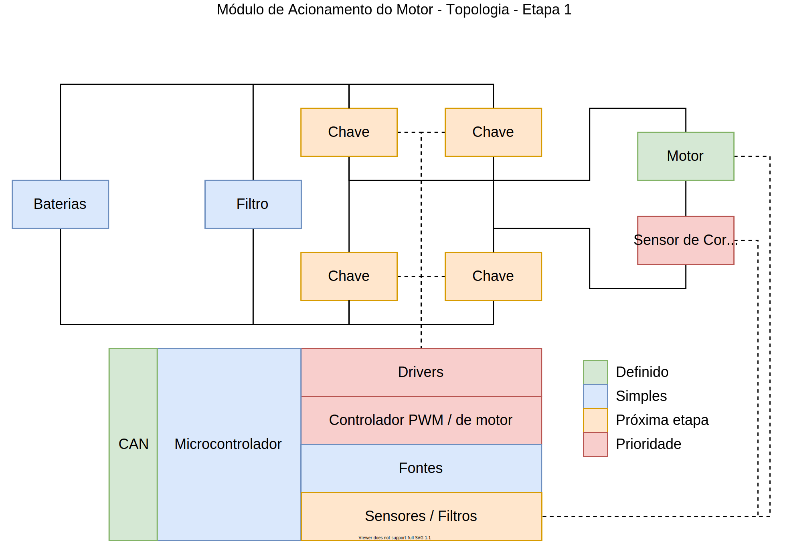

# MAM20
**M**ódulo de **A**cionamento do **M**otor 2020

Embarcação Guarapuvu II

Equipe Zênite Solar

### Sobre
Este módulo é responsável por realizar o acionamento de um motor de imã permanente, controlando sua velocidade e sentido de rotação.

### Requisitos de projeto

1. **Acionamento do motor**
   - Permitir o acionamento nos dois sentidos
   - Permitir o controle em malha fechada
     - Corrente/Torque
     - Tensão/RPM

       

2. **Proteções**

   - Sobre-temperatura do motor

   - Sobre-temperatura do acionamento

   - Sobre-tensão de entrada

   - Sobre-corrente de saída

   - Falha de comunicação

   - Desconexão dos mosfets de potência

     - Garantir que os mosfets permaneçam desligados se a placa de controle for removida

   - Lógica para início de funcionamento

     - O motor só pode ser acionado se o procedimento de início for seguido na sequência correta

       - Dead man`s switch conectado

       - Sistema elétrico ativado

       - Potenciômetro em zero

       - Chave do motor ligada

         

3. **Interfaces**

   - Ser controlado pela rede CANBUS implementada na embarcação

   - Sinalização por meio de LEDs

   - Permitir debug pela serial

     

### Abordagens

Especificações do conversor

| Tensão de Entrada | 20 ~ 60 V |
| ----------------: | :-------- |
|   Tensão de Saída | 0 ~ 48V   |
| Corrente de Saída | 150 A     |
|        Eficiência | > 80%     |

Dados os requisitos e especificações apresentadas anteriormente, foi definido que a topologia utilizada será um conversor ***chopper***, por não haver necessidade de elevação de tensão e por este permitir a variação da tensão média na carga mantendo uma boa eficiência. 

Em um motor DC, a inversão de seu sentido de rotação é feita com a inversão da polaridade, obtida conforme a lógica de acionamento das chaves da ponte H. Uma característica da ponte H completa é que além da inversão de polaridade é possível criar lógicas de acionamento para frear o motor. Importante lembrar que **AS CHAVES DO MESMO BRAÇO NUNCA DEVEM SER ACIONADAS AO MESMO TEMPO**, sob pena de destruição das chaves ou danos ao sistema elétrico da embarcação.

Para que seja possível o monitoramento dos parâmetros do motor e para fechar a malha de controle, precisarão ser empregados sensores para o monitoramento da corrente e rotação do motor. O diagrama abaixo apresenta a topologia utilizada para o acionamento.

O motor utilizado pela embarcação é o **[ME0909](https://www.electricmotorsport.com/me0909-pmdc-motor-12-48v-4-hp-cont-12-8-hp-pk.html)**. Este motor possui tensão de operação de 12 ~ 48V e 4,8 kW de potência nominal.

A rede CAN utilizada será a já implementada atualmente.
