# Embedded System Simulation with PSIM

O objetivo deste documento é registrar a implementação inicial de uma simulação
de sinais mistos (mixed signals simulation) de um chopper operando nos quatro
quadrantes, usando o PSIM.

## Table Of Contents

- [1.0. Chopper](#10-chopper)
- [2.0. Pilot Controller](#20-pilot-controller)
- [3.0. Signal Conditioning](#30-signal-conditioning)
- [4.0. PWM Peripheral](#40-pwm-peripheral) 
- [5.0. Embedded Controller](#50-embedded-controller)
  - [5.1. ADC Inputs](#51-adc-inputs)
    - [5.1.1. ADC Test](#511-adc-test)
  - [5.2. Digiital Inputs](#52-digital-inputs)
  - [5.3. Outputs](#53-outputs)
    - [5.3.1. PWM](#531-pwm)
- [6.0. Firmware](#60-Firmware)
- [7.0. Test](#70-Test)  

---

## 1.0. Chopper

O circuito do chopper foi implementado de modo a possibilitar o comando
individual das chaves, assim como a medição das correntes e tensões de entrada e
saída, além de separar a entrada e saída, a fim de facilitar mudanças na
simulação.

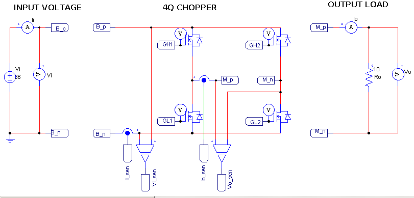

---

## 2.0. Pilot Controller

O Pilot Controller aqui é utilizado para simular comandos supostamente
utilizados pelo piloto, como:

- ligar/desligar o acionamento (Enable)
- ligar/desligar a reversão do sentido de rotação (Rev)
- ligar/desligar a regeneração (Regen)
- modificar a potência % desejada (Power)

O esquemático utilizado e os sinais gerados podem ser vistos nas figuras abaixo:

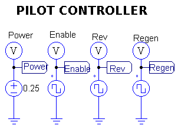
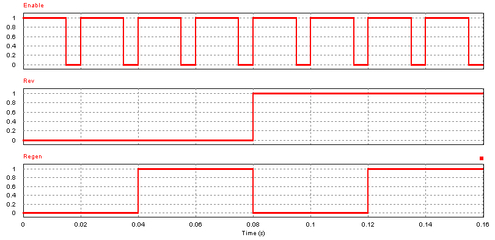

---

## 3.0. Signal Conditioning

O condicionamento dos sinais aqui é feito com um filtro passa-baixa, ganho e
offset (quando é necessário medir sinais positivos e negativos - full-range).

- O filtro passa-baixa é primeira ordem com a frequência de corte em 100Hz e
  pode ser facilmente alterada.
- O ganho aplicado é a razão entre a tensão máxima do ADC e o valor máximo a ser
  medido. No caso do full-range, é utilizada a metade da tensão máxima do ADC.
- Quando full-range, é aplicado um offset também com a metade da tensão máxima
  do ADC, afim de garantir o máximo aproveitamento de sua escala.

O esquemático utilizado e os sinais gerados podem ser vistos nas figuras abaixo:

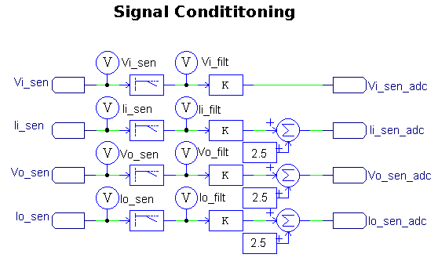
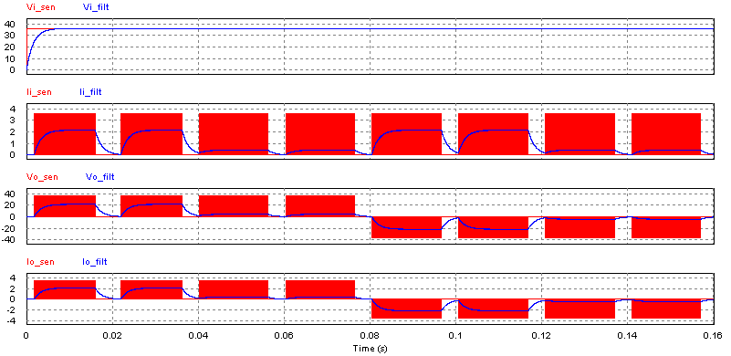

---

## 4.0. PWM Peripheral

O periférico de PWM é realizado com a comparação entre um sinal dente de serra
e uma referência que define o tempo ligado (que percentualmente é o duty-cycle).
O sinal resultante é um PWM com frequência igual à frequência do sinal dente de
serra utilizado (Freq), e com duty-cycle proporcional ao sinal DT.

Para acionar os braços da ponte H, são gerados dois sinais PWM controlados
individualmente, juntamente com seus sinais complementares. Os sinais
não complementares acionam as chaves de cima, enquantos os sinais complementares
acionam as chaves de baixo.

Por ser uma simulação idealista, não foi implementado o recurso de tempo-morto
(deadtime), mas se os mosfets não fossem ideias, este recurso seria
indispensável para impedir que o curto de braço ocorresse a cada período de
chaveamento.

O esquemático utilizado e os sinais gerados podem ser vistos nas figuras abaixo:

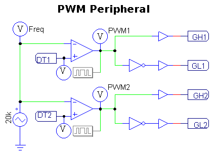
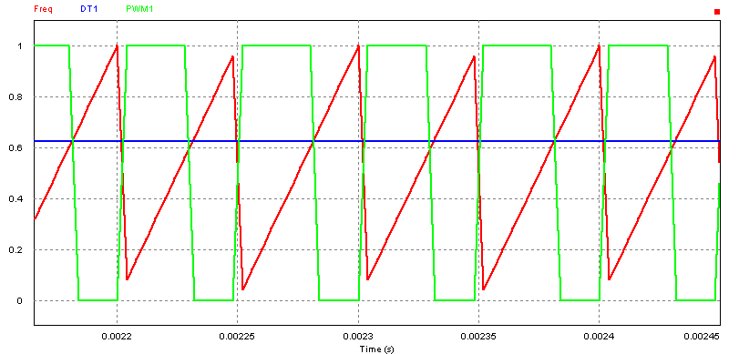

---

## 5.0. Embedded Controller

O controlador embarcado é implemetado utilizando um elemento C Block, possuindo
inicialmente 8 entradas e 20 saídas, que podem ser expandidas e que permitem a
interação do código escrito em C com as variáveis presentes na simulação.

### 5.1. ADC Inputs

Para implementar o ADC como um periférico do tipo SAR com *N* canais
compartilhando um único comparador, poderia ser utilizado uma sequência de
blocos como o 'Quantization function block', e 'Sampling/hold block', mas para
ter um melhor domínio da solução (e também para deixá-la mais portável para
algum outro simulador), foi optado realizar todas estas funções em um bloco
'C Block', implementando a quantização, o segurador, e também o atraso entre
a amostragem dos canais multiplexados.

O sinal para acionamento da amostragem de cada canal é controlado por um sinal
de clock `ADC_CLOCK`, gerado pelo bloco CONTROLLER. Sempre que uma conversão é
finalizada, o bloco SAR_ADC gera um pulso em uma de suas saídas, chamado 
`END_OF_CONVERSION`, que por sua vez é lido pelo bloco CONTROLLER e atua como
o sinal de interrupção do microcontrolador, chamando a função `adc_interrupt()`,
que faz a conversão e guarda os valores em variáveis globais do CONTROLLER.

O código escrito em C está contido no arquivo [chopper_4q__sar_adc.c](chopper_4q__sar_adc.c).

#### 5.1.1. ADC Test

Por se tratar de uma implementação que precisa ser testada individualmente, uma
segunda simulação foi criada, contendo o mínimo necessário para testar a
implementação. O teste faz sucessivas conversões com os 4 canais, amostrando o
mesmo sinal, que deve ser comparado com o sinal original (chamado de `in`).

O esquemático utilizado e os sinais gerados podem ser vistos nas figuras abaixo:

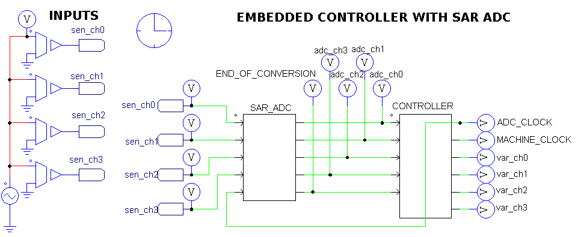
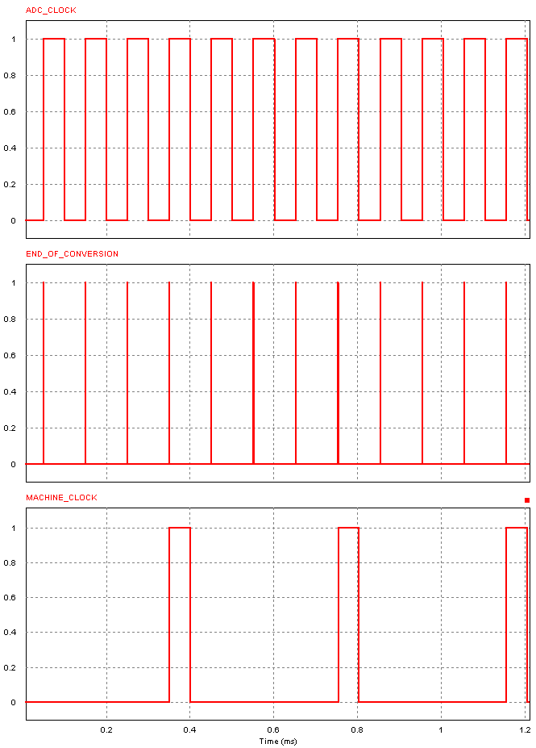
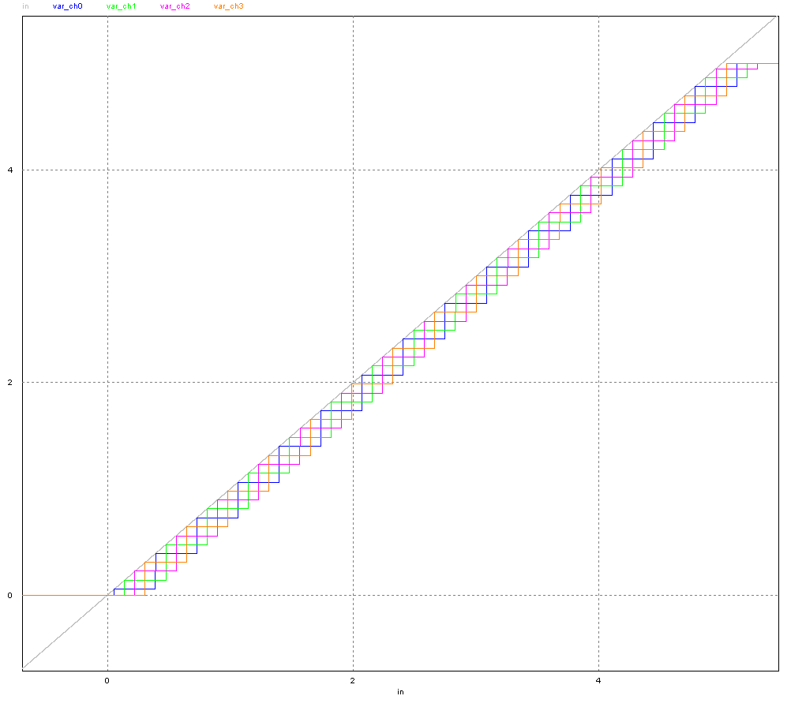
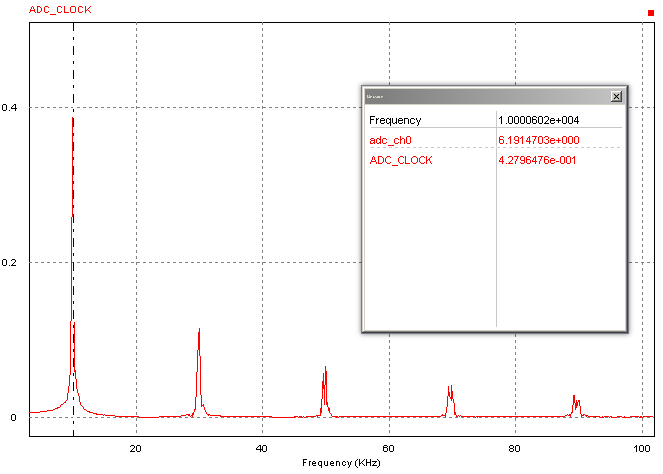

A figura abaixo detalha o sinal original e o sinial lido pelo CONTROLLER:

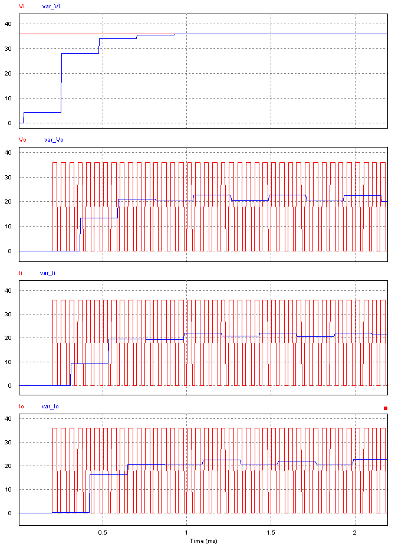

### 5.2. Digital Inputs

Os sinais digitais são diretamente conectados no CONTROLLER, e seu threshold é
definido dentro do código (0.5) usando um operador ternário para transformar
no valor `0` ou `1`.

### 5.3. Outputs

Os sinais relevantes do CONTROLLER são externalizados utilizando diversas portas
de saída monitorados por multímetros.

#### 5.3.1. PWM

O valor de duty-cycle computado pelo controlador é externalizado passando por um
quantizador, de modo a transformar o valor interno em um sinal quantizado com a
precisão em bits que um timer utilizado no periférico permitir. Inicialmente foi
utilizado 7 bits.

---

### 6.0. Firmware

No C Block, é possível escrever código em 4 abas. Aqui usamos apenas duas delas:

- `FUNCTIONT TYPE (Variable/Function definitions)` é onde definimos as variáveis
  e funções, que seria análogo aos arquivos incluídos por `#include`, sendo
  headers ou sources.
- `RunSimUser Fcn` é a função que a simulação chama a cada iteração de intervalo
  timestep da simulação.

O código inicial pode ser visto no arquivo [chopper_4q__embedded_controller.c](chopper_4q__embedded_controller.c).

Todos os testes realizados neste documento utilizram ele, sem nenhuma
modificação drástica entre as etapas, a fim de documentar um estado básico e 
sólido para as possíveis centenas de iterações com a simulação até o
desenvolvimento final do sistema.

---

## 7.0. Test

Com todas as partes integradas na mesma simulação, podemos simular a interação
entre um sistema físico e seu firmware.

Na figura abaixo pode ser visto os sinais de corrente e tensão acionando uma 
carga resistiva nos quatro quadrantes em decorrência dos controles do piloto.

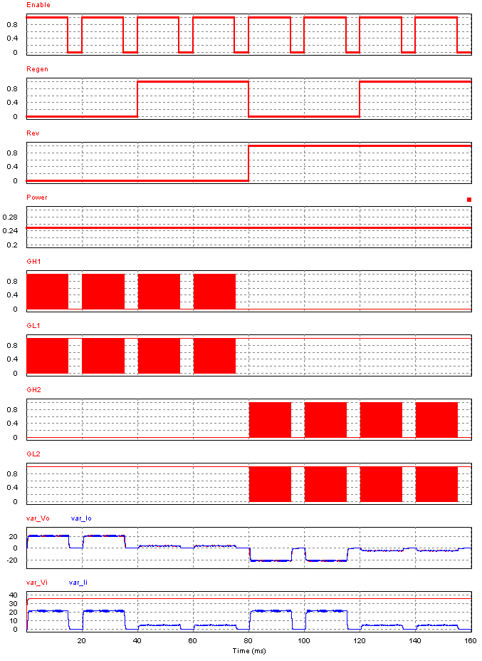
